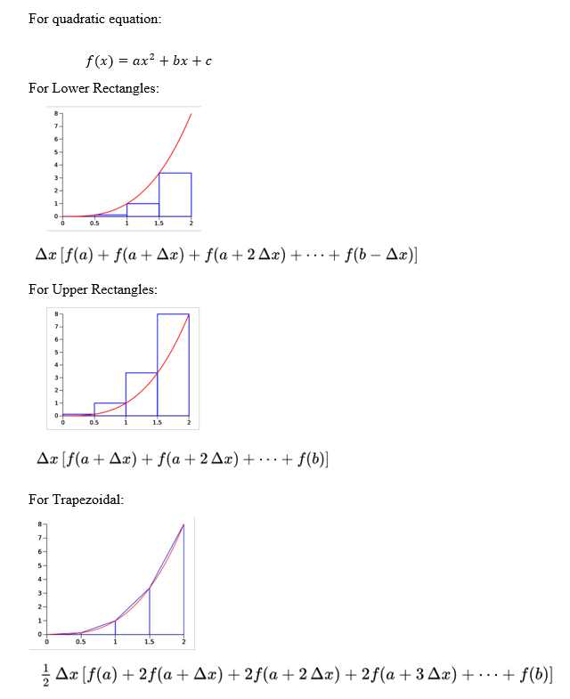

# Taking-Integral-in-C
a, b and c are coefficients of a quadratic equation.\n
X1 is the lower boundry, X2 is the upper boundry of the integral. X2 is supposed to be greater than X1.
N is the number of rectangles. So, greater N will result more precise integral solution.
DeltaX is the width of a rectangle.

